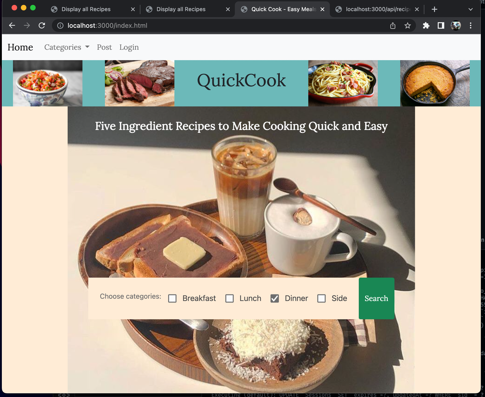

# QuickCook

## Recipe Manager for quick, short ingredient list, recipes.

---

## Project Description:

Many recipes call themselves quick, but how often are they easy? If they are easy, how often are they good?

Here is an app dedicated to quality recipes that feature only 5 ingredients.

The site has recipes to browse and also allows the logged in user to post their own recipes.

The form for doing so limits the recipe to 5 ingredients so that they are in keeping with the spirit of the site.

---

## Usage:

If running locally, download all the files from the GitHub repo below, run `npm i`, then run `npm start` and go-to localhost:3000/index.html

or, go-to

https://bootcamp-project-2-quickcook.herokuapp.com

---

**GitHub Repo:**

https://github.com/wreising/Week_8-Project_2-QuickCook

**Heroku:**

https://bootcamp-project-2-quickcook.herokuapp.com

*© 2022 QuickCook LLC.*